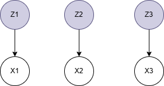

## Background and Motivation
*This post is an excerpt of concepts related to the use of causality in generative modeling, based on the literature.

Generative modeling has become prominent due to several factors.
1. It can estimate data densities based on some given data.
2. It can generate new data.

However, generative modeling falls behind in certain aspects.
1. Ability to extrapolate can be weak - this also relates to its generalization ability, or the robustness of the model. Generative models can perform weak when presented with out-of-distribution data from what it has seen during training (the same goes with generation of new extrapolated data). 
2. Depend on spurious feature correlations - Most ML models rely on feature correlations to recognize patterns. This can result in the models depending on spurious correlations. [This behavior can be attributed to that most of the ML models falling into associative category in Pearl's causal hierarchy. This category can only do inference based on associations, not on cause-effect understanding. This lays a foundation for the motivation of using causality in generative modeling]

Generative modeling has one core task which helps in proper data generation - representation learning. Optimum representations should be meaningful, interpretable, and disentagled. Here, disentangled representations give us independent factors of variation of the data such that we can vary one factor of variation while keeping others fixed (a similar concept is ICA (Independent Component Analysis)). 
However, most models suffer from a problem called unidentifiability problem. Unidentifiability problem refers to the fact that we are unable to find these independent sources of variation from the given datasets. There are several proposals to learn such disentangled representations ($\beta$-VAE is a well-known example) but they suffer from identifiability problem or they rely on assumptions such as data is IID and factors of variation are independent. Although we use the independence of factors to help in the idenitifiability problem, it may not be realistic as most real-world data can have interdependent factors of variation. Hence, a different perspective of the problem can help us reach a more pragmatic approach; using causal models.

## Causal Models and representation learning
Causal models represent the cause-effect relationships between variables governing a data generating process. The variables can be endogeneous (observed), exogeneous (unobserved), and noise terms. Usually these relationships can be represented in the form of a graph (called Structural Causal Model (SCM)). A typical SCM is shown in Figure 1. In fact, we can see that independent factor scenario is a special case of SCMs (Figure 2)(Z represent exogeneous variables, and X represent endogeneous). 

We then come up with a paradigm called Causal representation learning (CRL). The goal of CRL is to learn factors that are causally related, and meaningful (interpretability comes free if we meet these criteria).

We can try to understand why causal models would help us to overcome the two challenges in generative modeing mentioned above.
1. The causal model is (almost) invariant to distribution shifts. In fact, the principle of "Sparse mechanism shift" says that small distribution shifts affect sparsely on causal variables (or precisely the "Markov factorization" of causal variables).
2. Representations now won't rely on spurious correlations as the SCM provides the proper feature relationships or cause-effect information.

## Challenges for CRL
CRL also faces an identifiability problem. Note that, in traiditional settings it was about identifying properly disentangled factors. In CRL, disentanglement does not imply variable independence (as it cannot be, because we already treat variables have inter-dependencies). CRL disentanglement means that we identify independent causal mechanisms (or simply, functions that link causal variables to their parents; f:causes->effects). [This is defined in a principal called "Independent Causal Mechanisms (ICM)".]. The identifiability problem can come in when we are unable to identify such causal mechanisms, the causal structure and the involved causal variables. There are different proposals to handle this identifiability issues.
Evaluation metrics such as Disentanglement, Completeness and Informativeness (DCI), and Causal Disentanglement Score (CDS) are used to measure the goodness of CRL.

## Controllable Counterfactual generation
Counterfactual generation is of major importance as a method of data augmentation, a gauge of reasoning ability and a mode of explanation (my main interest lies in counterfactual generation too). Controllable counterfactual generation is a case where we can intervene on desired attributes to generate counterfactual data samples using generative modeling, even in totally novel contexts (e.g. for image domain - Lions with green mane). Most of the controllable counterfactual generation proposals are based on GANs and Difussion models, and for image data. Some of such models are,
1. CausalGAN (Kocaoglu et al., 2018)
2. DCM (Diffusion based Causal Model; Chao et al. (2023))
3. VACA (Graph Variational AE based; Sánchez-Martin et al. (2022))

Axiomatic evaluation of counterfactuals can properly evaluate generated counterfactuals according to the counterfactual principles; effectiveness (whether interventions properly affect target variables), composition (identity intervention renders all variables unaffected ), reversibility (counterfactual and factual mapping is deterministic and invertible)

### References
- [1] - Emerging Synergies in Causality and Deep Generative Models: A Survey. Zhou and Xie, 2023
- [2] - From Identifiable Causal Representations to Controllable Counterfactual Generation: A Survey on Causal Generative Modeling. Komanduri et al., 2024
